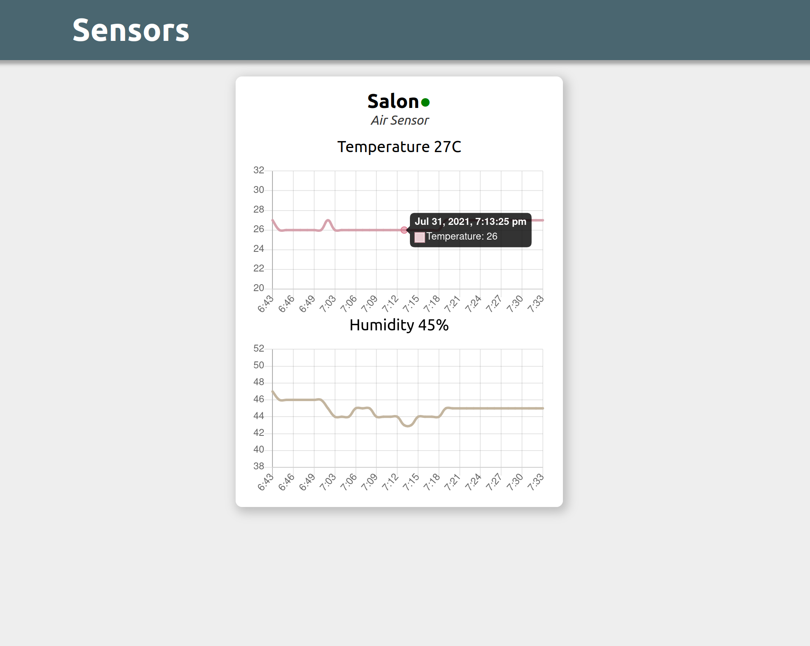

# DIY Air sensor
This is the whole source code of a little toy project that was created as a byproduct of having fun with AVR microcontrollers and electronics.

The project consists of 3 main components:

## device
C source code for ATmega328p (8-bit AVR) program which allows the server to request the environment temperature and humidity reading via DHT11 sensor.
Communication is performed via Bluetooth Low Energy (BLE) by the MLT05 module.

## server
Rust HTTP server powered by Actix. Target system is a computer (in my case Raspberry Pi 3) with BLE connectivity.
The server is responsible for discovering the sensor devices, querying them, storing the readings and exposing them over a REST API.

## ui
A simple front-end for the server written in pure Typescript (no frameworks). It shows the sensor temperature and humidity timelines.

